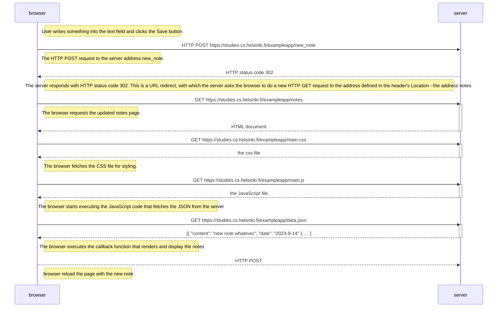

#[ 0.4 ] New Note Diagram 

  

```mermaid
sequenceDiagram
    participant browser
    participant server

        Note right of browser: User writes something into the text field and clicks the Save button.
       
        browser->>server: HTTP POST https://studies.cs.helsinki.fi/exampleapp/new_note
        Note right of browser: The HTTP POST request to the server address new_note.
        
        server-->>browser: HTTP status code 302
        Note right of browser :  The server responds with HTTP status code 302. This is a URL redirect, with which the server asks the browser to do a new HTTP GET request to the address defined in the header's Location - the address notes.

        browser->>server: GET https://studies.cs.helsinki.fi/exampleapp/notes
        activate server
        Note right of browser: The browser requests the updated notes page.
        server-->>browser: HTML document
        deactivate server
     
        browser->>server: GET https://studies.cs.helsinki.fi/exampleapp/main.css
        activate server
        server-->>browser: the css file
        deactivate server
        Note right of browser: The browser fetches the CSS file for styling.

        browser->>server: GET https://studies.cs.helsinki.fi/exampleapp/main.js
        activate server
        server-->>browser: the JavaScript file
        deactivate server

        Note right of browser: The browser starts executing the JavaScript code that fetches the JSON from the server

        browser->>server: GET https://studies.cs.helsinki.fi/exampleapp/data.json
        activate server
        server-->>browser: [{ "content": "new note whatever", "date": "2023-9-14" }, ... ]
        deactivate server

        Note right of browser: The browser executes the callback function that renders and display the notes

        browser-->>server: HTTP POST

        Note right of browser: browser reload the page  with the new note

```

*' diagram based of the notes provided on the [website](https://fullstackopen.com/en/part0/fundamentals_of_web_apps#loading-a-page-containing-java-script-review)* 
