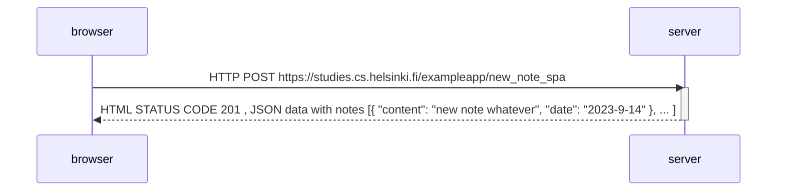

# [ 0.6 ] New note in single page app diagram 

```mermaid
sequenceDiagram
    participant browser
    participant server

    browser->>server: HTTP POST https://studies.cs.helsinki.fi/exampleapp/new_note_spa
    activate server
    server-->>browser: HTML STATUS CODE 201 , JSON data with notes [{ "content": "new note whatever", "date": "2023-9-14" }, ... ]
    deactivate server

```

*' diagram based of the notes provided on the [website](https://fullstackopen.com/en/part0/fundamentals_of_web_apps#single-page-app)*
