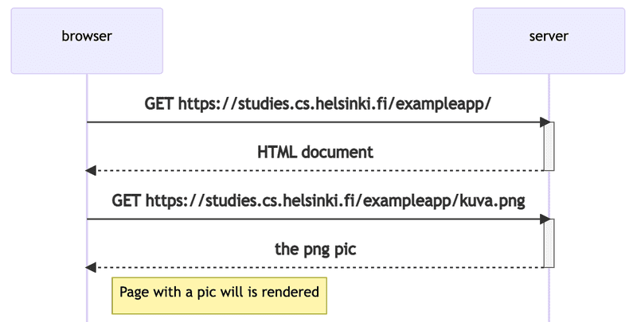
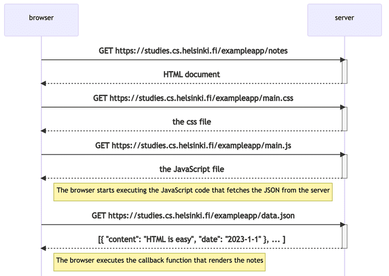

# [[ Part 0 ] Fundamentals of Web apps](https://fullstackopen.com/en/part0/fundamentals_of_web_apps)

*The 1st rule of web development: Always keep the Developer Console open on your web browser with console open*
  
**HTTP GET :** the server and the web browser communicate with each other using HTTP protocol. The **Network** tab shows how the browser and the server comunicate,
  
**Chain of events caused by opening the page**

  

**Tradiditonal Web Applications**
In traditional web applications, the browser is "dumb". It only fetches HTML data from the server, and all application logic is on the server.

**Running application logic in the browser**
The code doesn't contain data. The head section of the HTML contains a script tag , which causes the browser to fetch a JavaScript file. Immediately after fetching the script tag the browser begins to execute the code.

**Event handlers and Callback functions**
The request to the server is sent on the last line, but the code to handle the response is further up.
*Why?*
The mechanism of invoking event handlers is very common in JavaScript. Event handler functions are called callback functions. The application code does not invoke the functions itself, but the runtime environment - the browser, invokes the function at an appropriate time when the event has occurred.

**Document Object Model or DOM**
The functioning of the browser is based on the idea of depicting HTML elements as a tree.
Document Object Model, or DOM, is an API that enables programmatic modification of the element trees corresponding to web pages.

**CSS**
Style sheet language used to determine the appearance of web pages.

**Loading a page containing JavaScript**

**Forms and HTTP POST**
Web forms are one of the main points of interaction between a user and a website or application.

When the button on the form is clicked, the browser will send the user input to the server. In this case, submitting the form causes no fewer than five HTTP requests.

It is an HTTP POST request to the server address new_note. The server responds with HTTP status code 302. This is a URL redirect, with which the server asks the browser to do a new HTTP GET request to the address defined in the header's Location - the address notes.

So, the browser reloads the Notes page. The reload causes three more HTTP requests: fetching the style sheet (main.css), the JavaScript code (main.js), and the raw data of the notes (data.json).

**AJAX**
AJAX (Asynchronous JavaScript and XML) enabled the fetching of content to web pages using JavaScript included within the HTML, without the need to rerender the page.
  
[HTML Tutorial](https://developer.mozilla.org/en-US/docs/Learn/Getting_started_with_the_web/HTML_basics) | [CSS Tutorial](https://developer.mozilla.org/en-US/docs/Learn/Getting_started_with_the_web/CSS_basics) | [HTML forms Tutorial](https://developer.mozilla.org/en-US/docs/Learn/Forms/Your_first_form)
